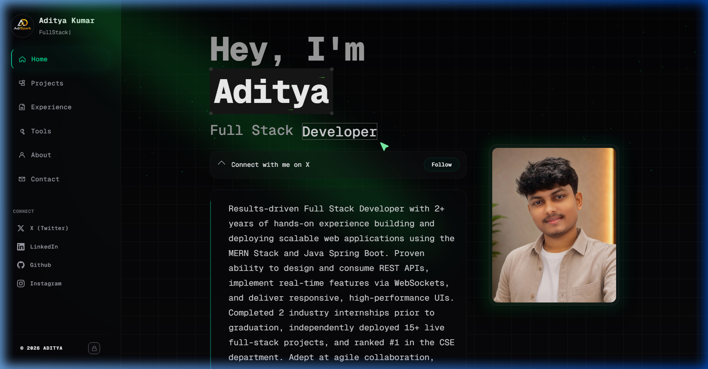
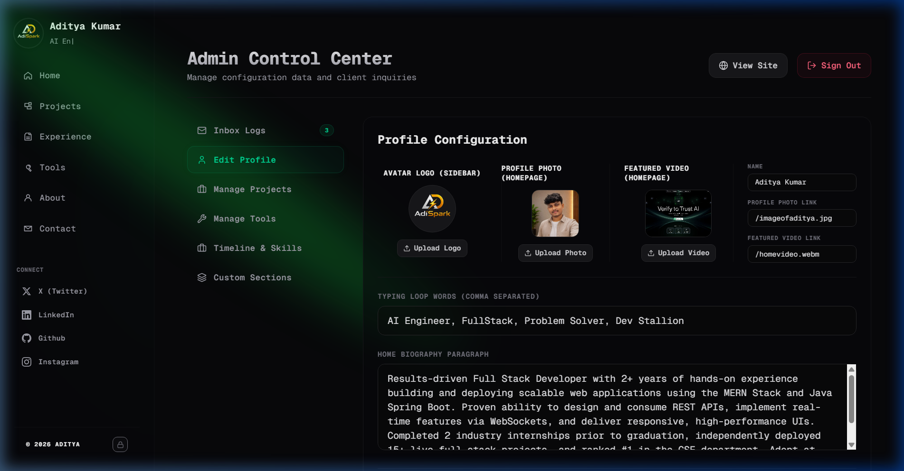

# Aditya Kumar - Premium Real-Time Developer Portfolio

<p align="center">
  <a href="https://github.com/Adityakumarsahoo/aditya">
    
  </a>
  <a href="https://github.com/Adityakumarsahoo/aditya">
    
  </a>
  <a href="https://github.com/Adityakumarsahoo/aditya">
    
  </a>
  <a href="https://github.com/Adityakumarsahoo/aditya">
    
  </a>
  <a href="https://github.com/Adityakumarsahoo/aditya">
    
  </a>
  <a href="https://github.com/Adityakumarsahoo/aditya">
    
  </a>
  <a href="https://github.com/Adityakumarsahoo/aditya">
    
  </a>
  <a href="https://github.com/Adityakumarsahoo/aditya">
    
  </a>
</p>

A state-of-the-art, high-fidelity developer portfolio designed to showcase projects, skills, career timeline highlights, and custom dynamic content blocks. Built with a modern, hardware-accelerated user experience, it features an Express.js backend and a Next.js (Turbopack) frontend with visual animations (Framer Motion, CSS blobs, interactive cards, and 3D parallax effects).

All content, profiles, typing words, skills, and projects are managed dynamically from the Admin Control Panel and synchronized in real-time to active visitors.

---

## 📸 Screenshots

### Live Dynamic Homepage


### Real-Time Admin Control Panel


---

## 🚀 Key Features

* **⚡ Real-Time Synchronized Admin Control:** Profile information, social links, experiences, tools, custom sections, and projects updated in the Admin Dashboard are synchronized instantly to all active clients using Server-Sent Events (SSE). No manual page reloads required.
* **📂 Local Image Upload Manager:** Admins can upload custom project thumbnails, avatars, and assets directly from their local computer. The backend automatically uploads them to Cloudinary CDN, falling back to local static directory storage if Cloudinary is offline or unconfigured.
* **🌐 Dynamic Project Live Links:** Supports displaying **GitHub** and **Live Link** action buttons side-by-side on project cards and details pages (with Live Link aligned on the right), reading dynamically from either `visit` or `link` keys.
* **🔄 Zero-Cache Data Pipelines:** Configured HTTP cache-invalidation headers on the backend and client-side `{ cache: "no-store" }` fetch overrides to guarantee visitors always see the latest profile information immediately.
* **✨ Premium Hover Glare Cards:** Projects are wrapped in `CometCard` reflections that follow cursor movement with neon glare vectors.
* **🎨 Staggered Skill Category Glows:** Career skill badges stagger their load times and glow with corresponding category-specific neon colors (Blue for Frontend, Emerald for Backend, Purple for AI, Amber for Databases, Rose for DevOps, and Cyan for Tools) when hovered.
* **🎈 Ambient Atmospheric Blobs:** Sleek, floating ambient blobs drift gracefully in the background using performance-optimized CSS animations.
* **🛡️ Robust Local Fallbacks:** If MongoDB or Cloudinary credentials are omitted from variables, the backend automatically transitions to local JSON databases (`backend/data/`) and static folder uploads (`backend/uploads/`) for immediate offline usage.

---

## 🛠️ Technology Stack

### Frontend
* **Core:** Next.js 16 (App Router, Turbopack, React 19)
* **Styling:** Tailwind CSS v4, Vanilla CSS
* **Animations:** Framer Motion (`motion/react`)
* **Icons:** Lucide React
* **Real-Time Hook:** EventSource connection utilizing custom React refs for stable persistent streams

### Backend
* **Runtime:** Node.js, Express.js
* **Database:** MongoDB (via Mongoose ODM) with local JSON file storage fallback
* **Uploads:** Cloudinary (CDN Media API) with local filesystem upload fallback
* **Security:** JSON Web Tokens (JWT) & HTTP-Only Secure Cookies

---

## ⚙️ Environment Configurations

### 1. Frontend (`.env.local`)
Create a `.env.local` file in the root workspace directory:
```env
NEXT_PUBLIC_API_URL=http://localhost:5000
```

### 2. Backend (`backend/.env`)
Create a `.env` file inside the `backend` folder:
```env
PORT=5000
ADMIN_PASSWORD=your_admin_password_here
JWT_SECRET=your_jwt_signing_secret_key
FRONTEND_URL=http://localhost:3000

# MongoDB Integration (Optional - falls back to local JSON files if omitted)
MONGODB_URI=mongodb+srv://<username>:<password>@cluster.mongodb.net/portfolio?retryWrites=true&w=majority

# Cloudinary CDN Integration (Optional - falls back to local /uploads if omitted)
CLOUDINARY_CLOUD_NAME=your_cloud_name
CLOUDINARY_API_KEY=your_api_key
CLOUDINARY_API_SECRET=your_api_secret
```

---

## 📦 Getting Started

### 1. Clone & Set Up Dependencies

```bash
# Install root (Frontend) dependencies
npm install

# Install backend dependencies
cd backend
npm install
```

### 2. Run in Development Mode

Run the backend and frontend servers simultaneously for real-time development:

```bash
# Start backend server (listening on port 5000)
cd backend
npm run dev

# Start Next.js frontend (listening on port 3000)
# Open another terminal window in the root directory:
npm run dev
```

### 3. Production Build & Compilation

To build the client application for production hosting:

```bash
# Build frontend
npm run build

# Start production server
npm run start
```

---

## 🛡️ Database & Upload Fallbacks

This codebase is designed with a **fail-safe architectural pattern**:
1. **Database Fallback:** If `MONGODB_URI` is omitted from the environment variables, the backend automatically reads and writes to local JSON files stored under `backend/data/` (e.g., `projects.json`, `profile.json`, `skills.json`, `custom-sections.json`). On first connection to MongoDB, these local records are automatically migrated to MongoDB.
2. **Asset Upload Fallback:** If Cloudinary keys are missing, the media uploads API writes uploaded avatars and showcase videos directly to the local server storage at `backend/uploads/` and hosts them statically.

---

## 🔒 Administration Access
To configure and edit the portfolio content, navigate to `/admin/login` on your browser and sign in using the `ADMIN_PASSWORD` defined in your backend `.env` variables (Default fallback credentials: password `admin123`).
